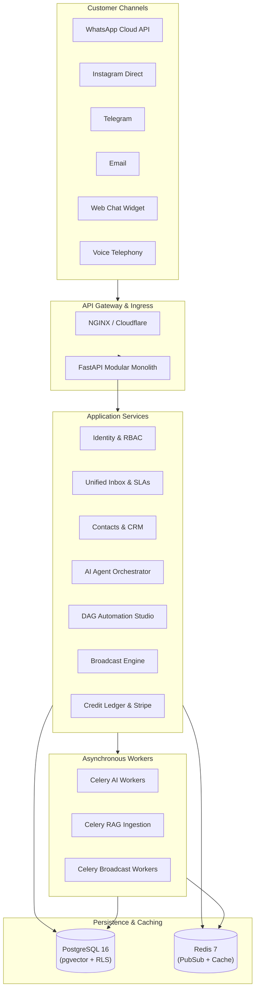

# Gabster AI — System Architecture Specification

## 1. Executive Architectural Overview

Gabster AI is an enterprise-grade, omnichannel AI customer operations SaaS platform designed for high-throughput messaging, AI-first conversational customer support, automated CRM workflows, voice agents, and WhatsApp Business API integration.



---

## 2. Multi-Tenancy & Data Isolation Model

Tenant isolation is enforced through **PostgreSQL Row-Level Security (RLS)** backed by composite foreign keys.

### 2.1 Enforcement Strategy
1. Every tenant-owned table features `organization_id UUID NOT NULL REFERENCES organizations(id) ON DELETE CASCADE`.
2. Each HTTP request resolves the active tenant workspace via authenticated JWT claims or the `X-Organization-ID` header.
3. The database session executes `SET LOCAL app.current_org_id = :org_id` within the active transaction block.
4. RLS policies reject any query accessing or modifying rows where `organization_id != app.current_org_id`.
5. Standard application database roles do NOT possess `BYPASSRLS`.

```sql
ALTER TABLE conversations ENABLE ROW LEVEL SECURITY;
ALTER TABLE conversations FORCE ROW LEVEL SECURITY;

CREATE POLICY tenant_isolation_policy ON conversations
    FOR ALL
    USING (organization_id = NULLIF(current_setting('app.current_org_id', true), '')::uuid)
    WITH CHECK (organization_id = NULLIF(current_setting('app.current_org_id', true), '')::uuid);
```

---

## 3. High-Velocity Storage & Indexing Strategy

### 3.1 Primary Keys: UUIDv7
All relational tables utilize **time-ordered UUIDv7** primary keys. By combining a 48-bit millisecond timestamp with cryptographically secure random bytes, sequential B-tree insertions maintain index locality and avoid heap fragmentation.

### 3.2 High-Throughput Feeds
- **Messages**: Clustered and indexed on `(conversation_id, created_at ASC)`.
- **Active Inbox**: Partial B-tree index on `(organization_id, assigned_user_id, status, last_message_at DESC)` filtering out closed tickets.
- **WhatsApp 24hr Window**: Indexed on `(organization_id, service_window_expires_at)`.

---

## 4. RAG Architecture & Vector Search

- **Vector Database**: PostgreSQL 16 `pgvector` extension.
- **Index Type**: **HNSW (Hierarchical Navigable Small World)** with `vector_cosine_ops`.
- **Chunking Pipeline**: Semantic and paragraph-aware boundary detection.
- **Retrieval Engine**: Multi-stage hybrid search combining pgvector dense cosine similarity with pg_trgm lexical BM25 matching.

---

## 5. Double-Entry Credit Accounting

To eliminate race conditions and financial discrepancies in usage-based billing:
- **Materialized Balances**: `credit_balances` stores cached available credits with a database-level constraint `CHECK (balance_credits >= 0)`.
- **Immutable Ledger**: Every AI token burn, voice call minute, or WhatsApp message writes an immutable row into `credit_ledger`.
- **Concurrency Control**: Credit deductions utilize `SELECT ... FOR UPDATE` row locks to prevent double-spending.
