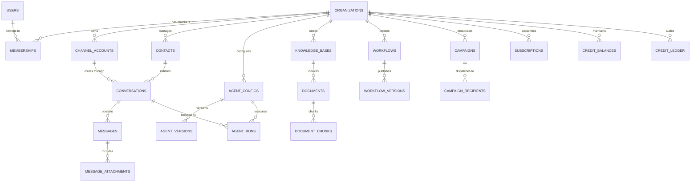

# Gabster AI — Database Entity Relationship Diagrams (ERD)

## 1. High-Level Domain Relationship Diagram

```mermaid
erDiagram
    ORGANIZATIONS ||--o{ MEMBERSHIPS : "has members"
    USERS ||--o{ MEMBERSHIPS : "belongs to"
    ORGANIZATIONS ||--o{ CHANNEL_ACCOUNTS : "owns"
    ORGANIZATIONS ||--o{ CONTACTS : "manages"
    CONTACTS ||--o{ CONVERSATIONS : "initiates"
    CHANNEL_ACCOUNTS ||--o{ CONVERSATIONS : "routes through"
    CONVERSATIONS ||--o{ MESSAGES : "contains"
    MESSAGES ||--o{ MESSAGE_ATTACHMENTS : "includes"
    ORGANIZATIONS ||--o{ AGENT_CONFIGS : "configures"
    AGENT_CONFIGS ||--o{ AGENT_VERSIONS : "versions"
    AGENT_CONFIGS ||--o{ AGENT_RUNS : "executes"
    CONVERSATIONS ||--o{ AGENT_RUNS : "handled by"
    ORGANIZATIONS ||--o{ KNOWLEDGE_BASES : "stores"
    KNOWLEDGE_BASES ||--o{ DOCUMENTS : "indexes"
    DOCUMENTS ||--o{ DOCUMENT_CHUNKS : "chunks"
    ORGANIZATIONS ||--o{ WORKFLOWS : "creates"
    WORKFLOWS ||--o{ WORKFLOW_VERSIONS : "publishes"
    ORGANIZATIONS ||--o{ CAMPAIGNS : "broadcasts"
    CAMPAIGNS ||--o{ CAMPAIGN_RECIPIENTS : "dispatches to"
    ORGANIZATIONS ||--o{ SUBSCRIPTIONS : "subscribes"
    ORGANIZATIONS ||--o{ CREDIT_BALANCES : "maintains"
    ORGANIZATIONS ||--o{ CREDIT_LEDGER : "audits"
```

---

## 2. Core Relational Entities Specification

```mermaid
erDiagram
    ORGANIZATIONS {
        uuid id PK
        string name
        string slug UK
        string status
        jsonb settings
        timestamp created_at
    }

    USERS {
        uuid id PK
        string email UK
        string password_hash
        string full_name
        string status
        timestamp created_at
    }

    MEMBERSHIPS {
        uuid id PK
        uuid organization_id FK
        uuid user_id FK
        uuid role_id FK
        string role
        string agent_status
        boolean is_active
    }

    CONTACTS {
        uuid id PK
        uuid organization_id FK
        string first_name
        string last_name
        string email
        string phone_number
        string lifecycle_stage
        jsonb custom_attributes
    }

    CONVERSATIONS {
        uuid id PK
        uuid organization_id FK
        uuid contact_id FK
        uuid channel_account_id FK
        uuid assigned_user_id FK
        string status
        string priority
        timestamp service_window_expires_at
        timestamp last_message_at
    }

    MESSAGES {
        uuid id PK
        uuid organization_id FK
        uuid conversation_id FK
        string sender_type
        string content_type
        text text_content
        string delivery_status
        timestamp created_at
    }

    AGENT_CONFIGS {
        uuid id PK
        uuid organization_id FK
        string name
        string mode
        boolean is_active
        uuid current_version_id
    }

    DOCUMENT_CHUNKS {
        uuid id PK
        uuid organization_id FK
        uuid document_id FK
        integer chunk_index
        text content_text
        vector embedding
    }

    CREDIT_BALANCES {
        uuid id PK
        uuid organization_id FK
        numeric balance_credits
        numeric lifetime_consumed_credits
    }

    CREDIT_LEDGER {
        uuid id PK
        uuid organization_id FK
        string transaction_type
        numeric amount
        numeric balance_after
        string description
    }
```
